# MeltyFi

**Making the illiquid liquid** - An innovative peer-to-pool lending and borrowing protocol with NFT collateral through lottery mechanics

## 🎯 Overview

MeltyFi is a revolutionary DeFi protocol that enables **peer-to-pool lending and borrowing with NFT collateral** through an innovative lottery-based system inspired by Charlie and the Chocolate Factory. Unlike traditional NFT-backed lending platforms, MeltyFi eliminates the risk of involuntary liquidation by operating independently of off-chain factors like floor prices.

## 🍫 The Chocolate Factory Analogy

In MeltyFi, each NFT is like a **chocolate bar**. When borrowers need liquidity:

1. **🍫 Breaking the Bar**: The NFT (chocolate bar) is divided into **WonkaBars** (chocolate squares)
2. **💰 Selling Squares**: Lenders buy WonkaBars to fund the loan
3. **🎫 Golden Ticket**: If the loan isn't repaid, one random WonkaBar contains the "golden ticket" to win the NFT
4. **🍪 ChocoChips**: All participants earn governance tokens as rewards

This process **"melts"** the illiquid NFT into liquid capital while maintaining fairness for all parties.

## ✨ Key Features

- 🔒 **Zero Liquidation Risk**: NFTs are never forcibly liquidated due to price fluctuations
- 🎲 **Lottery-Based Funding**: Transparent, fair distribution mechanism
- 🏆 **Win-Win Design**: Benefits for both borrowers and lenders
- 🎮 **Gamified Experience**: Engaging chocolate factory theme
- 🌐 **Fully Decentralized**: No dependence on external price oracles
- ⚡ **Chainlink Integration**: Provably random winner selection

## 🏗️ Protocol Architecture

```
┌─────────────────┐    ┌─────────────────┐    ┌─────────────────┐
│   MeltyFiNFT    │    │   MeltyFiDAO    │    │   ChocoChip     │
│  (Core Logic)   │◄──►│  (Governance)   │◄──►│ (ERC-20 Token)  │
└─────────────────┘    └─────────────────┘    └─────────────────┘
         │                       │                       │
         ▼                       ▼                       ▼
┌─────────────────┐    ┌─────────────────┐    ┌─────────────────┐
│ LogoCollection  │    │ VRF Consumer    │    │   WonkaBars     │
│ (ERC-1155 Meme) │    │ (Randomness)    │    │ (ERC-1155 Tickets)│
└─────────────────┘    └─────────────────┘    └─────────────────┘
```

### Smart Contracts

#### 🎯 Core Contracts
- **MeltyFiNFT** (`0x6c1030B8BbE523671Bcfd774Ae59ef620f9f31b4`) - Main protocol logic
- **MeltyFiDAO** (`0xC4AA65a48fd317070F1A5aC5eBAC70F9d022Fb1e`) - Governance contract
- **ChocoChip** - ERC-20 governance token with voting capabilities
- **LogoCollection** - ERC-1155 meme token for protocol branding
- **VRFv2DirectFundingConsumer** - Chainlink VRF for random winner selection

#### 🎫 Token Standards
- **ERC-721**: NFT collateral support
- **ERC-1155**: WonkaBars (lottery tickets) and LogoCollection
- **ERC-20**: ChocoChip governance token with EIP-2612 permit functionality

## 🎲 Lottery States & Behavior

### State Diagram
```
    [Create Lottery]
           │
           ▼
    ┌─────────────┐
    │   ACTIVE    │
    │ (Can buy    │
    │ WonkaBars)  │
    └─────────────┘
           │
           ├─── Repay Loan ────► [CANCELLED] ──► Refund + ChocoChips
           │
           └─── Time Expires ──► [CONCLUDED] ──► Random Winner + ChocoChips
```

### 🎮 Lottery States Explained

#### 🟢 ACTIVE State
- **Duration**: From creation until expiration or repayment
- **Actions**: Lenders can purchase WonkaBars
- **Funds**: 95% goes to borrower, 5% to DAO treasury
- **Transition**: Can become CANCELLED (repayment) or CONCLUDED (expiration)

#### 🟡 CANCELLED State  
- **Trigger**: Borrower repays loan before expiration
- **Outcome**: NFT returned to borrower
- **Rewards**: 
  - Lenders get full refund + ChocoChips
  - Borrower gets ChocoChips for good behavior

#### 🔴 CONCLUDED State
- **Trigger**: Expiration date reached without repayment
- **Winner Selection**: Chainlink VRF randomly selects winner
- **Rewards**:
  - Winner gets NFT + ChocoChips
  - Other lenders get ChocoChips only

#### ⚫ TRASHED State
- **Condition**: No WonkaBars were ever purchased
- **Result**: Lottery automatically cleaned up

## 🚀 Protocol Workflows

### 📋 Use Cases Overview

```
🏦 BORROWER                    🎯 LENDER                    🤖 ORACLE
     │                            │                            │
     ├─ Create Lottery            ├─ Buy WonkaBars            ├─ Draw Winner
     └─ Repay Loan               └─ Melt WonkaBars           └─ (Automation)
```

### 🔄 Detailed Workflows

#### 1️⃣ **Create Lottery** (Borrower)

```mermaid
sequenceDiagram
    participant B as Borrower
    participant M as MeltyFiNFT
    participant N as NFT Contract
    
    B->>N: approve(MeltyFiNFT, tokenId)
    B->>M: createLottery(nftContract, tokenId, price, expiry, maxSupply)
    M->>N: transferFrom(borrower, MeltyFiNFT, tokenId)
    M->>M: mint WonkaBars for lottery
    M-->>B: Lottery created ✅
```


#### 2️⃣ **Buy WonkaBars** (Lender)


#### 3️⃣ **Repay Loan** (Borrower) 

```mermaid
sequenceDiagram
    participant B as Borrower
    participant M as MeltyFiNFT
    participant C as ChocoChip
    
    B->>M: repayLoan(lotteryId)
    M->>M: set lottery state to CANCELLED
    M->>M: transfer NFT back to borrower
    M->>C: mint ChocoChips to borrower
    M-->>B: Loan repaid, NFT returned 🎉
```


#### 4️⃣ **Melt WonkaBars** (Lender)


#### 5️⃣ **Draw Winner** (Oracle Automation)

```mermaid
sequenceDiagram
    participant O as Oracle
    participant M as MeltyFiNFT
    participant V as VRF Consumer
    
    O->>M: checkUpkeep() [expired lotteries?]
    M-->>O: performData [lottery IDs to conclude]
    O->>M: performUpkeep(performData)
    M->>V: requestRandomWords()
    V-->>M: fulfillRandomWords(requestId, randomWords)
    M->>M: select winner based on random number
    M->>M: set lottery state to CONCLUDED
    M-->>O: Winners drawn for expired lotteries 🎲
```


## 🎯 Protocol Scenarios

### 📈 **Scenario 1: Successful Repayment**
1. Borrower creates lottery with valuable NFT
2. Multiple lenders buy WonkaBars, funding the loan
3. Borrower receives 95% of funds immediately
4. Before expiration, borrower repays the loan
5. **Results**:
   - ✅ Borrower gets NFT back + ChocoChips
   - ✅ Lenders get full refund + ChocoChips
   - ✅ Everyone wins!

### 📉 **Scenario 2: Loan Default**
1. Borrower creates lottery but cannot repay
2. Lottery expires and transitions to CONCLUDED
3. Chainlink VRF randomly selects winner
4. **Results**:
   - 🏆 One lucky lender wins the NFT + ChocoChips
   - 🍪 Other lenders receive ChocoChips as consolation
   - 💔 Borrower loses NFT but keeps the borrowed funds

## 💻 Frontend Architecture

### 🎨 User Interface
Built with modern React ecosystem for optimal user experience:

- **React 18** - Component-based UI framework
- **React-Bootstrap** - Responsive design components  
- **Ethers.js** - Ethereum blockchain interaction
- **thirdweb** - Web3 authentication and wallet connection
- **MetaMask** - Primary wallet integration
- **OpenSea API** - NFT metadata retrieval

### 📱 Pages & Features

#### 🏠 **Home Page**
- Protocol introduction and chocolate factory explanation
- Key features and benefits overview
- How-to-use guide for new users

#### 🎰 **Lotteries Page**
- **Browse Lotteries**: View all active lotteries with filtering
- **Create Lottery**: Select NFTs and set lottery parameters
- Real-time lottery status and participation data
- Interactive lottery cards with NFT previews

#### 👤 **Profile Page** 
- View owned lotteries and their current status
- Check WonkaBar holdings and win probabilities
- Monitor ChocoChip balance and transaction history
- Manage active positions and claim rewards

## 🛠️ Installation & Setup

### Prerequisites

```bash
# Required software
- Node.js (v16 or higher)
- MetaMask browser extension
- Git

# Required tokens  
- Goerli testnet ETH (from faucet)
- LINK tokens (for oracle funding)
```

### 🔧 Backend Setup

```bash
# Clone the repository
git clone https://github.com/VincenzoImp/MeltyFi.NFT
cd MeltyFi.NFT/src/back-end/MeltyFiProtocol

# Install dependencies
npm install

# Environment configuration
cp .env.example .env
# Add your keys:
# ALCHEMY_API_KEY=your_alchemy_key
# GOERLI_PRIVATE_KEY=your_private_key  
# ETHERSCAN_API_KEY=your_etherscan_key

# Compile smart contracts
npx hardhat compile

# Run comprehensive test suite
npx hardhat test

# Deploy to Goerli (if needed)
npx hardhat run scripts/deploy.js --network goerli

# Verify contracts on Etherscan
npx hardhat verify --network goerli CONTRACT_ADDRESS
```

### 🎨 Frontend Setup

```bash
# Navigate to frontend directory
cd src/front-end/meltyfi.nft

# Install React dependencies
npm install

# Start development server
npm start

# Build for production
npm run build
```

The application will be available at `http://localhost:3000`

## 📊 Contract Interactions

### 🔍 **Reading Contract State**

```solidity
// Get lottery information
function getLotteryInfo(uint256 lotteryId) 
    external view returns (Lottery memory);

// Check WonkaBar balance
function balanceOf(address account, uint256 lotteryId) 
    external view returns (uint256);

// Get ChocoChip balance
function balanceOf(address account) 
    external view returns (uint256);

// Check if address won lottery
function isWinner(address account, uint256 lotteryId) 
    external view returns (bool);
```

### ✍️ **Writing Contract State**

```solidity
// Create new lottery
function createLottery(
    IERC721 _prizeContract,
    uint256 _prizeTokenId, 
    uint256 _wonkaBarPrice,
    uint256 _expirationDate,
    uint256 _wonkaBarsMaxSupply
) external;

// Purchase lottery tickets
function buyWonkaBars(uint256 _lotteryId, uint256 _amount) 
    external payable;

// Repay loan and cancel lottery  
function repayLoan(uint256 _lotteryId) external;

// Claim rewards and prizes
function meltWonkaBars(uint256 _lotteryId, uint256 _amount) 
    external;

// Manually trigger winner selection
function drawWinner(uint256 _lotteryId) external;
```

## 🔐 Security Features

### 🛡️ **Smart Contract Security**
- **OpenZeppelin Standards**: Battle-tested contract implementations
- **Reentrancy Guards**: Protection against common attack vectors
- **Access Control**: Role-based permissions and ownership
- **Input Validation**: Comprehensive parameter checking
- **Emergency Controls**: Circuit breakers for critical functions

### 🔒 **Oracle Security** 
- **Chainlink VRF**: Provably random and tamper-proof randomness
- **Direct Funding**: Anyone can fund oracles to ensure availability
- **Fallback Mechanisms**: Manual winner drawing if automation fails
- **No External Dependencies**: Floor price independence eliminates oracle manipulation

### 🚨 **Protocol Safety**
- **No Liquidation Risk**: Borrowers cannot lose NFTs unexpectedly
- **Fair Distribution**: Proportional lottery chances based on investment
- **Transparent Operations**: All actions recorded on-chain
- **Automated Processes**: Reduced human error through smart contracts

## 🌐 Live Deployment

### 📍 **Contract Addresses (Goerli Testnet)**

| Contract | Address | Etherscan |
|----------|---------|-----------|
| MeltyFiNFT | `0x6c1030B8BbE523671Bcfd774Ae59ef620f9f31b4` | [View](https://goerli.etherscan.io/address/0x6c1030B8BbE523671Bcfd774Ae59ef620f9f31b4) |
| MeltyFiDAO | `0xC4AA65a48fd317070F1A5aC5eBAC70F9d022Fb1e` | [View](https://goerli.etherscan.io/address/0xC4AA65a48fd317070F1A5aC5eBAC70F9d022Fb1e) |

### 🚀 **Live Applications**
- **MeltyFi.NFT DApp**: [https://meltyfi.nft](https://meltyfi.nft)
- **MeltyFi.DAO DApp**: [https://meltyfi.dao](https://meltyfi.dao) *(Coming Soon)*

### 📝 **Example Transactions**
- **Create Lottery**: [`0xe68f3f6...`](https://goerli.etherscan.io/tx/0xe68f3f68b00dce4c299d0205dfbc72c302ae4d5e089b16d3c024755db70ffdf3)
- **Melt WonkaBars**: [`0xd957d27...`](https://goerli.etherscan.io/tx/0xd957d276b5499f6ad40e62a47ad9fd74f255f0a6fc6e1240903fd8aaf1337c3f)

## ⚠️ Known Limitations

### 🐌 **Protocol Limitations**
- **Slow Funding**: Loans require multiple lenders to participate
- **Uncertainty**: Three possible outcomes create complexity for lenders
- **Gas Costs**: Complex lottery mechanics increase transaction costs
- **Testnet Only**: Currently deployed on Goerli for testing

### 🔧 **Technical Limitations**
- **Oracle Dependency**: Relies on Chainlink for automation and randomness
- **Frontend Gaps**: DAO interface not yet implemented
- **Scalability**: May face congestion on mainnet deployment

## 🚀 Future Roadmap

### 🎯 **Phase 1: Production Ready**
- ✅ Mainnet deployment with audited contracts
- ✅ Layer 2 integration (Polygon, Arbitrum, Optimism)
- ✅ Enhanced security audits and bug bounties
- ✅ Mobile-responsive interface improvements

### 🎯 **Phase 2: Advanced Features**
- 🔄 Dutch auction lottery mechanisms
- 🎯 Multi-NFT collateral lotteries
- 💎 Fractional NFT support
- 🏪 NFT marketplace integration

### 🎯 **Phase 3: Ecosystem Expansion**
- 📱 Native mobile application
- 🌉 Cross-chain bridge functionality
- 🏛️ Fully functional DAO governance
- 🎮 Gamification enhancements

## 👥 Team

| Team Member | Role | Responsibilities |
|-------------|------|------------------|
| **Vincenzo Imperati** | Project Manager & Backend Developer | Smart contract development, system architecture, project coordination |
| **Benigno Ansanelli** | Frontend Developer | Lottery interface, user experience, documentation |
| **Andrea Princic** | Frontend Developer & UX Designer | Profile management, sequence diagrams, use case design |

## 🤝 Contributing

We welcome contributions from the community! Here's how you can help:

### 🔧 **Development Guidelines**
1. Fork the repository and create a feature branch
2. Follow existing code style and conventions
3. Add comprehensive tests for new functionality
4. Update documentation as needed
5. Test thoroughly on Goerli testnet

### 📋 **Contribution Areas**
- 🐛 Bug fixes and security improvements
- ✨ New features and enhancements
- 📚 Documentation and tutorials
- 🎨 UI/UX improvements
- 🧪 Testing and quality assurance

## 📄 License

This project is open source. Please refer to the repository for specific license details.

## 🔗 Important Links

### 🌐 **Project Resources**
- **GitHub Repository**: [VincenzoImp/MeltyFi.NFT](https://github.com/VincenzoImp/MeltyFi.NFT)
- **Live Application**: [meltyfi.nft](https://meltyfi.nft)
- **Documentation**: Available in repository `/docs` directory

### 🔧 **Development Tools**
- **Goerli Faucet**: [goerlifaucet.com](https://goerlifaucet.com)
- **OpenSea Testnet**: [testnets.opensea.io](https://testnets.opensea.io)
- **Remix IDE**: [remix.ethereum.org](https://remix.ethereum.org)

### 📚 **Educational Resources**  
- **Ethereum Documentation**: [ethereum.org](https://ethereum.org)
- **OpenZeppelin Contracts**: [openzeppelin.com](https://openzeppelin.com)
- **Chainlink Documentation**: [docs.chain.link](https://docs.chain.link)

---

**MeltyFi Protocol** - Where Charlie's chocolate factory meets DeFi innovation! 🍫✨

*Making illiquid NFTs liquid through the magic of lottery mechanics and community-driven finance.*
